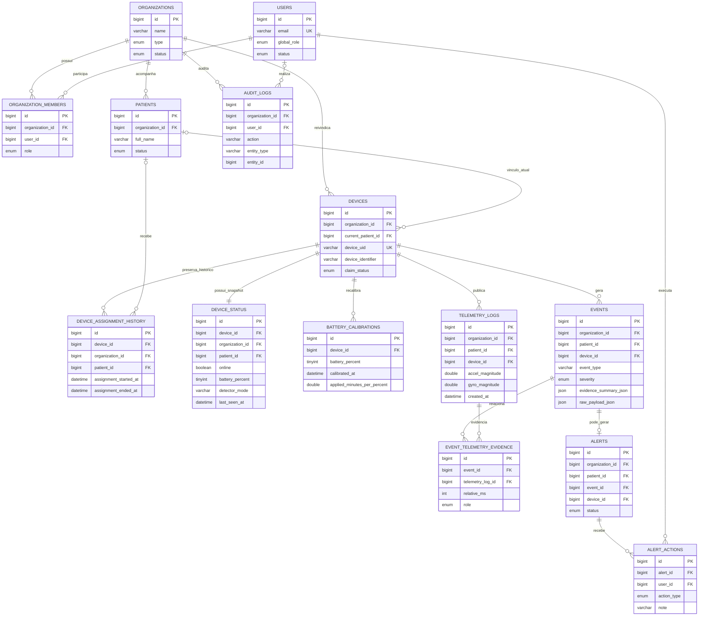

# Modelo de dados principal

Este diagrama resume as relações centrais do banco MySQL usado pelo `iot-fall-monitor`. Ele é uma visão de arquitetura para apresentação e manutenção; o contrato executável completo continua em [`database/schema.sql`](../database/schema.sql).

## Leitura do fluxo

1. Organização, usuários e memberships definem o escopo multi-tenant.
2. O device pode ser vinculado a um paciente, preservando mudanças em `device_assignment_history`.
3. `device_status` mantém o snapshot operacional; `telemetry_logs` mantém amostras válidas.
4. Eventos relacionam evidências de telemetria e podem originar um único alerta.
5. Ações humanas e operações administrativas permanecem rastreáveis em `alert_actions` e `audit_logs`.
6. Calibrações manuais de bateria ficam em `battery_calibrations` e alimentam a estimativa exibida no snapshot.

O `schema.sql` é voltado à criação/reset consciente de ambiente. Em bancos existentes, use somente as migrações idempotentes documentadas no projeto.
