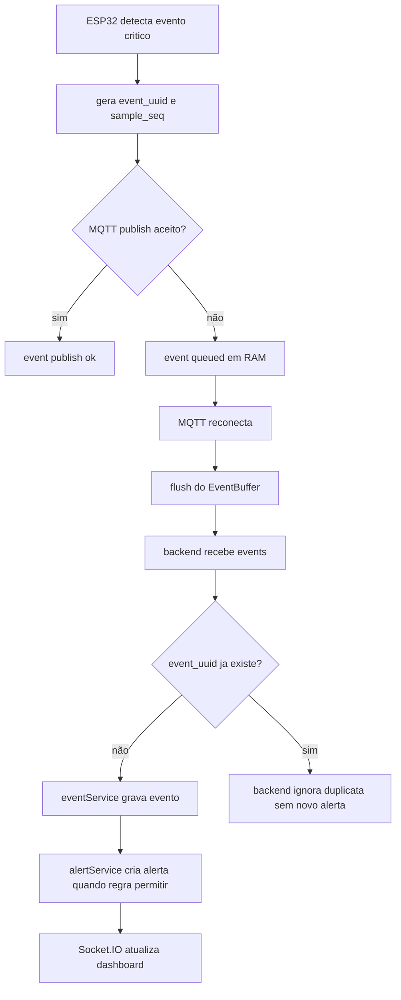

# Firmware e Hardware

Este documento concentra a documentação embarcada do projeto: pinagem recomendada, ligações, detalhes do `MPU6050`, portal local do ESP32, pairing por código, payloads do firmware, parâmetros de calibração e observações práticas de montagem e teste.

Para o fluxo completo com backend e frontend, consulte [integration.md](integration.md). Para setup geral do sistema, consulte o [README da raiz](../README.md). Para o passo a passo operacional no Windows, consulte [quickstart-windows.md](quickstart-windows.md).

## Ponto principal de configuração do ESP32

O firmware hoje trabalha com duas camadas:

1. defaults e constantes em [include/app_config.h](../include/app_config.h)
2. configuração persistida em `Preferences` / `NVS`

Na prática:

- `include/app_config.h` guarda defaults de fábrica, pinos, limites e thresholds
- o portal local do ESP32 grava em `NVS` as redes Wi-Fi, MQTT, `DEVICE_ID`, `MQTT_CLIENT_ID`, `BACKEND_API_BASE_URL`, `deviceSyncToken` e o perfil resumido do paciente
- depois da primeira configuração, você normalmente não precisa recompilar para mudar Wi-Fi, broker ou backend acessível para pairing

### O que continua em `include/app_config.h`

- `DEFAULT_DEVICE_ID`
- `DEFAULT_WIFI_SSID`
- `DEFAULT_WIFI_PASSWORD`
- `DEFAULT_MQTT_HOST`
- `DEFAULT_MQTT_PORT`
- `DEFAULT_MQTT_USERNAME`
- `DEFAULT_MQTT_PASSWORD`
- `DEFAULT_MQTT_CLIENT_ID`
- `DEFAULT_BACKEND_API_BASE_URL`
- `DEFAULT_MQTT_USE_TLS`
- `DEFAULT_MQTT_TLS_INSECURE`
- `DEFAULT_MQTT_TLS_CA_CERT`
- `DEFAULT_MQTT_TOPIC_BASE`
- `SETUP_AP_SSID_PREFIX`
- `SETUP_PORTAL_ALWAYS_ON`
- `FORCE_SETUP_MODE_ON_BOOT`
- `FIRMWARE_LOG_LEVEL`
- `FIRMWARE_I2C_DEBUG_ENABLED`
- `FIRMWARE_CONNECTIVITY_DEBUG_ENABLED`
- `FIRMWARE_EVENT_BUFFER_DEBUG_ENABLED`
- `DEVICE_PROFILE_SYNC_INTERVAL_MS`
- `DEVICE_PROFILE_SYNC_RETRY_INTERVAL_MS`
- `EVENT_BUFFER_PERSISTENCE_ENABLED`
- `PERSISTED_EVENT_BUFFER_CAPACITY`
- limites do portal, timeouts de fallback, pinos e thresholds do detector
- flags experimentais de features/FFT: `FALL_FEATURE_EXTRACTOR_ENABLED`, `FALL_FFT_EXPERIMENTAL_ENABLED`, `FALL_FFT_WINDOW_SIZE`, `FALL_FFT_SAMPLE_INTERVAL_MS`, `FALL_DECISION_ENGINE_VERSION`

## Estado atual do firmware

Plataforma e build:

- `platform = espressif32`
- `board = esp32dev`
- `framework = arduino`
- `monitor_speed = 115200`

Defaults atuais relevantes:

- `operationMode = "demo"` em configuração nova/factory; uma escolha já salva em NVS continua prevalecendo
- `DEFAULT_DEVICE_ID = "esp32_01"`
- `DEFAULT_MQTT_HOST = "broker.hivemq.com"`
- `DEFAULT_MQTT_PORT = 1883`
- `DEFAULT_BACKEND_API_BASE_URL = ""`
- `DEFAULT_MQTT_USE_TLS = false`
- `MAX_WIFI_NETWORKS = 5`
- `SETUP_AP_SSID_PREFIX = "Q-ESP32"`
- `SETUP_PORTAL_ALWAYS_ON = true`
- `BUZZER_ENABLED = false`
- `BUZZER_ACTIVE_HIGH = false`
- `SOS_BUTTON_ENABLED = false`
- `STATUS_LED_ENABLED = false`
- `MOTION_TEST_MODE_ENABLED = false`
- `FALL_FEATURE_EXTRACTOR_ENABLED = true`
- `FALL_FFT_EXPERIMENTAL_ENABLED = false`
- `FALL_FFT_WINDOW_SIZE = 64`

Comandos úteis no ambiente local atual (`COM5`, CP210x):

```powershell
cd C:\Queda
& "$env:USERPROFILE\.platformio\penv\Scripts\platformio.exe" run
& "$env:USERPROFILE\.platformio\penv\Scripts\platformio.exe" run -t upload --upload-port COM5
& "$env:USERPROFILE\.platformio\penv\Scripts\platformio.exe" device monitor --port COM5 --baud 115200
```

Não assuma mais problema de boot/upload para o ESP32 novo: com o driver CP210x instalado, a placa aparece como `Silicon Labs CP210x USB to UART Bridge` em `COM5` e o upload funciona sem segurar `BOOT`.

No Windows, se a `COM` ficar ocupada por um monitor antigo do `PlatformIO`, ajuste a porta do comando abaixo:

```powershell
.\scripts\free-serial-port.ps1 -Port COM5
```

Configuracao desejada do sensor no boot:

- barramento `I2C` a `100 kHz`
- leituras de registrador com STOP condition por padrão (`I2C_USE_REPEATED_START = false`)
- `WHO_AM_I` compatível com `0x68` (`MPU6050`), `0x70` (`MPU6500`) e `0x71` (`MPU9250`), com fallback de endereço para `0x69` quando necessário
- acelerômetro em faixa `+-8 g`
- giroscópio em faixa `+-500 dps`
- `DLPF` configurado para reduzir ruído de bancada

Depois de escrever os registradores, o firmware lê `ACCEL_CONFIG` e `GYRO_CONFIG` de volta e usa a faixa efetiva para converter raw em unidade física. Se o acelerômetro permanecer em `+-2 g`, o divisor usado será `16384 LSB/g`; se `+-8 g` for realmente aplicado, será `4096 LSB/g`. Isso evita repouso aparecendo como `4 g` por divisor incompatível. Em alguns módulos `MPU6500/MPU9250`, o readback pode permanecer em `0x00`; nesse caso a build aceita `+-2g/+-250dps` como faixa real em vez de tentar reconfigurar indefinidamente. Durante recoveries, se o readback falhar depois de uma escala efetiva já ter sido aceita, o firmware preserva a escala anterior para não gerar picos falsos.

O sensor é considerado pronto quando o firmware encontra um `WHO_AM_I` compatível e consegue fazer uma leitura raw básica. Falhas de readback de escala ou calibração não deixam mais `sensor_ready=0`: o firmware registra o motivo, usa divisor fallback coerente e continua publicando telemetria sem offsets. Pacote raw totalmente zerado (`ax=ay=az=gx=gy=gz=0`) é descartado e não vira amostra válida. Se `sensor_ready=0` por falha de boot, o loop tenta `sensor.begin()` novamente a cada `SENSOR_BEGIN_RETRY_INTERVAL_MS`.

Na `v0.8.30`, o firmware deixou de publicar `battery_level=100` como placeholder fixo. A bateria passa a ser opcional: se o operador preencher a porcentagem manual no portal ESP32, `status`, `telemetry` e `events` publicam `battery_level`, `battery_percent` e `battery_percent_source="manual"`. Se não houver valor configurado, o payload publica apenas `battery_percent_source="not_configured"` e o backend/frontend tratam como bateria não informada.

Na `v0.8.29`, os payloads do firmware foram apenas reorganizados internamente: identidade do device, bateria, RSSI, diagnóstico de sensor e campos da última leitura são preenchidos por helpers comuns em `src/main.cpp`. Isso reduz duplicação entre `events`, `status` e `telemetry`, mas não muda tópicos, nomes de campos nem regras de publicação.

### Estabilidade I2C do MPU6050

O erro serial `requestFrom(): i2cWriteReadNonStop returned Error -1` costuma aparecer quando o caminho repeated-start do `Wire` falha no barramento. Em bancada, a configuração atual evita depender desse modo:

- `I2C_CLOCK_HZ = 100000`
- `I2C_USE_REPEATED_START = false`
- `I2C_READ_RETRY_COUNT = 3`
- `SENSOR_I2C_RECOVERY_FAILURE_THRESHOLD = 8`
- `SENSOR_I2C_RECOVERY_TOTAL_ERROR_THRESHOLD = 64`

Quando houver falhas consecutivas ou volume alto de falhas intermitentes desde o último recovery, o firmware registra um resumo throttled, reinicia o barramento I2C, reconfigura o MPU6050 e não recalibra em loop. Se o recovery falhar, a última amostra válida fica preservada por uma janela curta. O status MQTT continua levando diagnóstico do sensor; a telemetria periódica só é publicada quando houver amostra válida e fresca.

Validação de bancada da `v0.8.30`: após compilar, enviar pela `COM5` e monitorar o ESP32 novo por cerca de `75 s`, o Serial Monitor manteve `sensor_ready=1`, `sensor_valid=1`, `sensor_read_ok=1`, `mqtt_connected=1`, `sample_age_ms` baixo, `accel_magnitude=1.00`, `i2c_errors=0` e `recoveries=0`, com `telemetry publish ok` contínuo. Isso é forte evidência de que a instabilidade anterior com milhares de `i2c_read_failed` era física ou de montagem/hardware e não do fluxo MQTT/backend/frontend. Se o erro voltar, investigue primeiro cabo, alimentação, GND comum, protoboard, módulo IMU e contato dos fios antes de refatorar backend ou frontend.

No Serial Monitor, procure:

- `[i2c] scan found address=0x68`
- `[sensor] probe ok address=0x68 who_am_i=0x70 model=MPU6500`
- `[sensor] range effective accepted ... accel=+-2g gyro=+-250dps` quando o chip não aceitar a faixa desejada
- `[sensor] read ok ... raw_magnitude_g=... corrected_magnitude_g=... filtered_magnitude_g=...`
- `[sensor] read failed reason=raw_all_zero` ou `i2c_read_failed` quando a leitura não deve alimentar telemetria

Checklist físico antes de investigar software:

- confirme GND comum entre ESP32 e MPU6050
- confirme VCC do módulo conforme a placa usada
- confira SDA/SCL nos pinos definidos em `I2C_SDA_PIN` e `I2C_SCL_PIN`
- use fios curtos e firmes
- evite mau contato em protoboard
- teste outro módulo MPU6050 se o erro persistir
- mantenha alimentação estável e clock I2C em `100 kHz`

## Logs e diagnóstico no firmware

O firmware agora usa um gating simples de logs em [include/app_config.h](../include/app_config.h):

- `FIRMWARE_LOG_LEVEL`
- `FIRMWARE_I2C_DEBUG_ENABLED`
- `FIRMWARE_CONNECTIVITY_DEBUG_ENABLED`
- `FIRMWARE_EVENT_BUFFER_DEBUG_ENABLED`
- `FIRMWARE_SENSOR_DIAGNOSTIC_ENABLED`
- `FIRMWARE_TELEMETRY_DIAGNOSTIC_ENABLED`
- `SERIAL_SENSOR_DEBUG_ENABLED`
- `MOTION_TEST_SERIAL_DEBUG_ENABLED`

Na prática:

- falhas e mensagens importantes continuam aparecendo
- diagnósticos detalhados de I2C, buffer e conectividade podem ser ligados sem poluir o loop principal por padrão
- com `FIRMWARE_CONNECTIVITY_DEBUG_ENABLED = true`, o firmware registra host/porta/clientId MQTT efetivos, tópicos de `status`, `telemetry` e `events`, e resultado de publish sem expor senha
- os logs de saúde do sensor mostram faixa efetiva, `lsb_per_g`, raw AX/AY/AZ/GX/GY/GZ, conversão em `g`/`deg/s`, calibração e magnitude publicada
- no boot, procure `ready=1 calibrated=0 reason=...` quando a calibração for pulada; isso ainda e operacional e deve publicar telemetria
- no boot, procure `[boot] sensor_begin_ok ... sensorReady=1` ou `[boot] sensor_begin_failed ... sensorReady=0`
- falhas I2C repetidas aparecem como resumo, por exemplo `[sensor] i2c errors summary ...`, e recovery aparece como `[i2c] recovery start`, `[i2c] bus restarted`, `[i2c] recovery ok` ou `[i2c] recovery failed`
- quando a telemetria não for publicada, procure `[telemetry] skipped reason=...`; os motivos esperados são `mqtt_disconnected`, `sensor_not_ready`, `no_valid_sample`, `stale_sample` e `publish_failed`
- o `MOTION TEST` continua com flags proprias para bancada, mas agora fica desabilitado por padrão para não misturar teste de bancada com alarme real

## Identidade do device e pairing

O firmware agora usa dois identificadores diferentes:

- `device_id`: nome operacional configurável no portal e usado nos tópicos MQTT
- `device_uid`: identidade técnica estável do ESP32, derivada do eFuse MAC

### O que isso resolve

- `device_id` pode mudar sem perder a identidade técnica do hardware
- o backend consegue distinguir discovery técnico de ownership real
- o claim usa `device_uid` + código temporário em vez de depender apenas de `device_id`

## Portal de configuração e pairing

O portal local do ESP32 agora cobre:

- redes Wi-Fi
- broker MQTT, porta, usuário e senha
- `DEVICE_ID`
- `MQTT_CLIENT_ID`
- `BACKEND_API_BASE_URL`
- claim por código temporário
- AP curto no padrão `Q-ESP32-xxxxxx`, usando os 6 últimos hexadecimais do chip
- modo de manutenção com `SETUP_PORTAL_ALWAYS_ON = true`, mantendo o portal aberto sem bloquear Wi-Fi station, MQTT ou telemetria
- bloco de saúde operacional com `Wi-Fi conectado`, `MQTT OK`, `Backend API` e `Pronto para operar`
- botoes `Testar backend` e `Testar MQTT`
- visualização do perfil resumido do paciente sincronizado
- pré-calibração experimental de alertas com sensibilidade, thresholds, janela, cooldown, publicação de eventos e buzzer
- botão `Testar buzzer`, que aciona um pulso curto não bloqueante quando o buzzer está habilitado na configuração atual

Capturas reais do portal `v0.9.0` estão disponíveis em [assets](assets/README.md):

- [visão geral ONLINE e AP de manutenção](assets/screenshots/esp32-maintenance-overview-v0.9.0.png)
- [saúde operacional com Wi-Fi, MQTT e backend](assets/screenshots/esp32-maintenance-health-v0.9.0.png)
- [MQTT e identidade sem credenciais preenchidas](assets/screenshots/esp32-maintenance-mqtt-config-v0.9.0.png)
- [energia e Modo Demo](assets/screenshots/esp32-maintenance-battery-demo-v0.9.0.png)
- [pré-calibração e thresholds Demo](assets/screenshots/esp32-portal-v0.9.0.png)

Fluxo oficial:

1. o ESP32 liga
2. tenta usar as redes e o MQTT salvos em `NVS`
3. se `SETUP_PORTAL_ALWAYS_ON = true`, sobe o AP de manutenção `Q-ESP32-*` em paralelo ao fluxo normal
4. se falhar ou estiver sem configuração válida, entra em `SETUP_MODE`
5. no setup/fallback, o mesmo AP `Q-ESP32-*` continua oferecendo o portal
6. o usuário abre o portal
7. salva rede, broker e backend
8. opcionalmente pareia o device informando o código temporário gerado no dashboard
9. o ESP32 reinicia e tenta operar normalmente

### Portal de manutenção sempre ativo em bancada

Com `SETUP_PORTAL_ALWAYS_ON = true`, o ESP32 opera em `WIFI_AP_STA`: o AP local permanece visível em `http://192.168.4.1`, enquanto a interface station segue conectando no Wi-Fi e o MQTT continua tentando publicar status, eventos e telemetria. Isso é diferente de `SETUP_MODE`, que é um modo de fallback/configuração.

Para restaurar o comportamento antigo, defina `SETUP_PORTAL_ALWAYS_ON = false`. Nesse caso, o AP aparece apenas quando o firmware entra em setup/fallback.

### Pré-calibração experimental de alertas

A seção de pré-calibração do portal permite testar o fluxo real sem recompilar:

- sensibilidade: `baixa`, `normal`, `alta` ou `teste/demonstração`
- threshold de aceleração resultante em `g`
- threshold de giroscópio em `deg/s`
- janela de análise em `ms`
- cooldown de alerta em `ms`
- habilitar/desabilitar publicação de eventos experimentais
- habilitar/desabilitar buzzer local
- testar buzzer local com pulso curto pelo portal

O modo `normal` preserva thresholds conservadores. Em configuração nova/factory, a build acadêmica inicia em `Demo apresentação` para facilitar a validação em bancada. O modo demo baixa os thresholds e pode gerar falsos positivos; use apenas com movimentos controlados do conjunto `ESP32 + MPU6050`, nunca com queda real de pessoa. Para operação conservadora, selecione `Normal` no portal. As configurações ficam em `NVS`, a escolha salva do usuário prevalece nos próximos boots e a sensibilidade passa a valer no loop atual sem reiniciar Wi-Fi/MQTT.

O botão `Testar buzzer` usa a configuração atualmente carregada. Se `Habilitar buzzer local para alerta` estiver desligado, o firmware registra `[buzzer] skipped reason=disabled event=portal_test` e o portal orienta habilitar, salvar e testar novamente.

### Como forcar SETUP_MODE em bancada

Se você quiser testar o modo bloqueante de setup sem depender de falha real de conectividade:

1. abra [include/app_config.h](../include/app_config.h)
2. defina `FORCE_SETUP_MODE_ON_BOOT = true`
3. grave o firmware
4. reinicie o ESP32
5. procure a rede `Q-ESP32-*`

Depois do teste, volte `FORCE_SETUP_MODE_ON_BOOT = false` para restaurar o comportamento normal.

### Observacao importante sobre upload

No ESP32 novo usado nesta rodada, o driver CP210x foi instalado, a placa aparece como `Silicon Labs CP210x USB to UART Bridge` em `COM5` e o upload funcionou sem segurar `BOOT`. Portanto, o diagnóstico atual não deve assumir problema de boot/upload; o foco é IMU/I2C, interpretação da telemetria e buzzer.

Comandos validados para a bancada atual:

```powershell
cd C:\Queda
& "$env:USERPROFILE\.platformio\penv\Scripts\platformio.exe" run -t upload --upload-port COM5
& "$env:USERPROFILE\.platformio\penv\Scripts\platformio.exe" device monitor --port COM5 --baud 115200
```

Se outra placa voltar a exigir `BOOT`, trate como limitação daquele hardware/driver específico, não como premissa do projeto.

## Captive portal e acesso pelo celular

Quando o ESP32 entra em setup ou quando o portal de manutenção está sempre ativo:

- sobe `AP + WebServer + DNSServer`
- responde probes comuns de captive portal
- tenta redirecionar para `http://setup.queda/`
- continua acessível manualmente em `http://192.168.4.1`

Na prática, isso tende a funcionar melhor em:

- Android
- Windows

No iOS, a notificação de "fazer login na rede" pode variar mais. Se ela não aparecer:

- abra `http://setup.queda`
- ou abra `http://192.168.4.1`

### Saúde operacional no portal

Como o portal pode existir tanto em `SETUP_MODE` quanto em manutenção paralela, a leitura de saúde precisa ser honesta:

- `Wi-Fi conectado` usa o estado station atual do ESP32
- `MQTT OK` pode vir de conexão atual ou do último `Testar MQTT`
- `Backend API` mostra validade da URL e último `Testar backend`
- em manutenção, `Pronto para operar` foca em Wi-Fi station + MQTT; em setup/fallback, também exige os testes esperados de configuração

Isso evita prometer que o device já está operando normalmente quando ele ainda está apenas em fase de ajuste/configuração.

### Energia e bateria manual

O portal ESP32 possui o card `Energia e bateria` para informar manualmente uma porcentagem entre `0` e `100`. Esse campo é persistido em `NVS` e serve apenas para copiar o valor exibido por um módulo externo de bateria durante testes de bancada.

Quando o campo está preenchido:

- `battery_level` recebe o valor manual para preservar compatibilidade com clientes antigos
- `battery_percent` recebe o mesmo valor manual
- `battery_percent_source` recebe `manual`

Quando o campo fica vazio:

- `battery_level` e `battery_percent` não são publicados pelo firmware
- `battery_percent_source` recebe `not_configured`
- o backend limpa placeholder antigo de bateria e o frontend mostra `--%`/`não informado`

Não trate o valor manual como leitura real. Placas de power bank/boost que exibem percentual no próprio módulo não entregam esse percentual automaticamente ao ESP32. A saída `5V` boost também não permite estimar porcentagem real de bateria com segurança, porque ela é regulada. Para medição automática futura, use uma das abordagens abaixo:

- divisor resistivo no `ADC` medindo a tensão da célula Li-ion/LiPo antes do conversor boost, com calibração e proteção adequada
- fuel gauge dedicado, por exemplo `MAX17048` ou `MAX17043`, ligado por `I2C`

## Telemetria e snapshot técnico

Nesta baseline, a telemetria continua sendo publicada em alta frequência, mas agora também leva:

- `battery_level`/`battery_percent` somente quando houver valor manual configurado ou leitura automática futura
- `battery_percent_source`, com `manual` ou `not_configured` nesta versão
- `wifi_rssi`

Unidades esperadas no payload MQTT:

- `ax`, `ay`, `az`: aceleração em `g`
- `gx`, `gy`, `gz`: giroscópio em `deg/s`
- `accel_magnitude`: aceleração resultante em `g`
- `gyro_magnitude`: giro resultante em `deg/s`

Com isso, o backend consegue manter bateria, RSSI e `lastSeenAt` mais coerentes nas telas sem depender apenas do `status` periódico.

Para online/offline, o backend usa a hora em que recebeu MQTT como `lastSeenAt`. Se o ESP32 ainda não sincronizou NTP e mandar `timestamp = millis()/1000`, ou se mandar um Unix time plausível mas stale demais, o backend usa a hora de recebimento para telemetria/eventos. Isso evita telemetria recém-chegada com data antiga, evidência de queda sem vínculo e status falsamente offline.

No dashboard, essa telemetria continua chegando no mesmo contrato MQTT. A visualização do gráfico do device normaliza apenas a camada visual: `accel_magnitude` aparece como `Aceleração resultante (g)`, o tooltip mostra giroscópio e eixos AX/AY/AZ com unidades, e outliers fora da escala visual são escondidos sem apagar ou alterar os dados persistidos.

No firmware atual, a telemetria periódica continua rodando mesmo com o portal de manutenção ativo e mesmo se houver candidato/alerta de queda. O portal em modo manutenção não inicia scan Wi-Fi automático (`SETUP_PORTAL_SCAN_IN_MAINTENANCE_MODE = false`), porque scan em `WIFI_AP_STA` pode interferir no link station/MQTT em alguns ESP32. Em `SETUP_MODE` o scan continua disponível para ajudar a cadastrar redes.

O payload real também carrega campos técnicos extras ignorados por clientes antigos:

- `battery_percent` alem de `battery_level`, quando houver valor manual configurado
- `battery_percent_source`
- `rssi` alem de `wifi_rssi`
- `sensor_ready`
- `sensor_valid`
- `sensor_read_ok`
- `sensor_sample_age_ms`
- `sensor_failures`
- `i2c_error_count`
- `i2c_recovery_count`
- `i2c_last_error`

Esses campos ajudam a diferenciar "ESP32 vivo publicando status" de "sensor sem leitura válida". Payloads diagnósticos sem eixos reais não devem ser tratados como telemetria real pelo backend.

Para confirmar publicação real em bancada, rode no notebook:

```powershell
npm run mqtt:watch --prefix backend
```

Para gerar telemetria válida sem ESP32 físico:

```powershell
npm run mqtt:publish:test --prefix backend -- --device esp32_01 --count 10
```

### Procedimento de teste real de telemetria

1. Suba broker, backend e frontend com o fluxo local do projeto.
2. Abra um terminal fixo:

```powershell
npm run mqtt:watch --prefix backend
```

3. Abra o Serial Monitor do ESP32 em `115200`.
4. Reinicie o ESP32.
5. Confirme no Serial Monitor:
   - `[wifi]`/`Wi-Fi conectado` com IP station
   - `[mqtt] connected broker=... clientId=...`
   - `[mqtt] topic telemetry=queda/devices/esp32_01/telemetry`
   - `[sensor] mpu range accel=+-...g gyro=+-...dps`
   - `[sensor] accel scale lsb_per_g=...`
   - `[sensor] calibration ok ...` ou `calibration skipped reason=...`
   - `[sensor] ready=1 calibrated=...`
   - `[sensor] read ok ...`
   - `[telemetry] publish ok ...` repetindo a cada `TELEMETRY_REPORT_INTERVAL_MS` quando houver amostra fresca
6. Confirme que não aparece repetidamente `[telemetry] skipped reason=sensor_not_ready`, `no_valid_sample` ou `stale_sample`.
7. Deixe o ESP32 parado sobre a mesa e confirme `[sensor] read ok ... magnitude=...` perto de `1.00 g`.
8. Confirme que o Serial não fica inundado por erro I2C; falhas repetidas devem virar resumo e recovery.
9. Se ocorrer recovery, procure `[i2c] recovery ok`; se aparecer `[i2c] recovery failed`, revise o checklist físico.
10. Confirme no `mqtt:watch` linhas novas em `queda/devices/esp32_01/telemetry`.
11. Confirme no dashboard que AX/AY/AZ estão em `g`, `accel_magnitude` fica perto de `1 g` em repouso e o gráfico estabiliza perto de `1 g`.
12. Mexa o sensor rapidamente e confirme que a aceleração sobe temporariamente.
13. Deixe parado novamente e confirme retorno para perto de `1 g`.
14. Se aparecer `[telemetry] skipped reason=mqtt_disconnected`, o problema está no link MQTT/reconnect.
15. Se aparecer `[telemetry] skipped reason=no_valid_sample` ou `stale_sample` com `sensor_ready=1`, o problema está em leitura raw temporária/I2C após o boot.
16. Se aparecer `[telemetry] skipped reason=sensor_not_ready`, o firmware não encontrou o MPU6050 ou não conseguiu leitura raw básica no boot.
17. Se o Serial mostrar `publish ok` mas o `mqtt:watch` não receber, verifique host/porta, broker efetivo, clientId e rede.

## Buzzer, alertas e motion test

O buzzer está conservador para bancada:

- `BUZZER_ENABLED = false` por padrão
- polaridade explícita via `BUZZER_ACTIVE_HIGH`
- default `BUZZER_ACTIVE_HIGH = false`, adequado para módulos active-low comuns
- `MOTION_TEST_MODE_ENABLED = false` por padrão

Na prática:

- boot, Wi-Fi connecting, MQTT connecting, setup mode e warning visual não devem acionar buzzer
- o alarme real por queda/SOS e o alerta experimental de bancada usam o buzzer apenas quando ele está habilitado na pré-calibração do portal
- o buzzer é não bloqueante e registra `[buzzer] alert pulse start reason=...` e `[buzzer] alert pulse end reason=...`
- o boot registra `[buzzer] enabled=... pin=... active_high=...`; quando habilitado, dispara um autoteste curto `boot_autotest`
- o botão do portal registra `[buzzer] test pulse start reason=portal_test` e `[buzzer] test pulse end reason=portal_test`
- o teste de bancada deixa de ficar habilitado por padrão em uso normal
- se a placa usar buzzer ativo-low, a inversao agora pode ser tratada em `include/app_config.h` sem mexer na logica do alarme

## Multiplas redes Wi-Fi e saúde de conectividade

O ESP32 salva até `5` redes Wi-Fi.

Comportamento atual:

- tenta as redes em ordem
- a primeira e tratada como preferida
- salvar o mesmo `SSID` atualiza a rede existente
- se nenhuma conectar e `SETUP_PORTAL_ALWAYS_ON = false`, entra em `SETUP_MODE`
- se nenhuma conectar e `SETUP_PORTAL_ALWAYS_ON = true`, mantém o portal de manutenção ativo sem bloquear o loop principal

Estados logicos de conectividade:

- `NO_WIFI`
- `WIFI_CONNECTING`
- `WIFI_OK_MQTT_CONNECTING`
- `ONLINE`
- `SETUP_MODE`

O device só e considerado realmente operacional em `ONLINE`.

## Fallback automático por falha de MQTT

O firmware também entra em setup quando:

- o `MQTT_HOST` estiver vazio, inválido ou apontando para loopback
- o Wi-Fi conectar, mas o MQTT falhar por tempo ou tentativas suficientes
- a configuração estiver incompleta

Isso evita o estado ruim de "Wi-Fi ok, mas broker quebrado sem caminho claro de recuperação".

Com `SETUP_PORTAL_ALWAYS_ON = true`, falhas repetidas de MQTT deixam o portal já disponível para correção, mas não desconectam o MQTT nem interrompem sensor, status/eventos e tentativas normais. Com a flag em `false`, o fallback antigo para `SETUP_MODE` permanece.

## Confiabilidade de eventos críticos MQTT

A partir da `v0.8.25`, o firmware diferencia telemetria periódica de eventos críticos. `telemetry` continua leve e sem fila obrigatória; eventos do canal `events`, como `fall_detected` e SOS manual, recebem identificadores rastreáveis e podem ser reenviados depois de queda temporária do MQTT.

Regras atuais:

- cada evento crítico recebe `event_uuid`, `event_sequence` e `sample_seq`
- apenas eventos críticos do canal `events` entram no `EventBuffer`
- `status` e `telemetry` não viram histórico local nem competem com alertas no buffer
- quando o publish falha ou o MQTT está desconectado, o payload completo do evento entra em fila circular em RAM
- quando o MQTT reconecta, `flushBufferedEvents()` reenvia eventos pendentes e só remove o item depois de `publish` aceito pelo cliente MQTT
- se o buffer lotar, o firmware preserva o evento mais recente e descarta o mais antigo, registrando `event dropped by buffer limit`
- a build também pode salvar um snapshot pequeno em `NVS` quando `EVENT_BUFFER_PERSISTENCE_ENABLED=true`

Limites importantes:

- a garantia principal é a fila em RAM; ela não deve ser tratada como persistência durável contra perda de energia
- o snapshot em `NVS` reduz perda em alguns reboots, mas não substitui um journal completo
- `SPIFFS`/`LittleFS` ficam como evolução futura para persistência durável de eventos críticos
- o `PubSubClient` usado no firmware publica em QoS 0; clientes Node de teste podem usar QoS 1 quando o broker suportar

Fluxo resumido:



## MQTT/TLS preparado, mas opt-in

O comportamento padrão do projeto continua sendo `MQTT` sem `TLS`, compatível com broker local simples.

Nesta rodada, o firmware ficou preparado para um caminho futuro com TLS por defaults em `app_config.h`:

- `DEFAULT_MQTT_USE_TLS`
- `DEFAULT_MQTT_TLS_INSECURE`
- `DEFAULT_MQTT_TLS_CA_CERT`

Uso previsto:

- manter `DEFAULT_MQTT_USE_TLS = false` para o fluxo atual
- usar `DEFAULT_MQTT_USE_TLS = true` apenas quando houver broker `mqtts://` coerente
- preferir CA válida quando possível
- usar `DEFAULT_MQTT_TLS_INSECURE = true` apenas em cenários de teste controlado

## Pairing pelo portal local

O portal possui uma seção específica de pairing.

### O que o usuário informa

- `BACKEND_API_BASE_URL`
- `pairing_code`

### O que o firmware envia

- `device_uid`
- `device_id`
- `device_name`
- `pairing_code`

### Resultado esperado

- o backend valida o código
- faz o claim transacional
- devolve `deviceSyncToken` e o perfil resumido do paciente atual
- o device fica locked naquela organização
- se o código foi gerado com paciente inicial, o backend também cria o vínculo inicial

### UX atual do pairing no portal

O portal foi simplificado para o caminho que funciona de forma mais consistente em captive portal HTTP e no uso por celular:

- preencher `BACKEND_API_BASE_URL`
- preencher `pairing_code`
- clicar em `Parear agora`

Mensagens esperadas no portal:

- `Código expirado. Gere um novo no dashboard.`
- `Código inválido. Confira o valor informado.`
- `Código já utilizado. Gere outro código.`
- `Não foi possível alcançar o backend nessa URL. Use o IP real do notebook na rede atual.`
- `Backend API inválida. Use o IP real do notebook na rede atual com http:// ou https://.`

## Perfil resumido do paciente no ESP32

Depois do claim e nas sincronizações posteriores, o ESP32 pode manter em `NVS` uma copia resumida do paciente atual do device.

Campos atuais:

- `patientName`
- `weightKg`
- `heightCm`
- `fallSensitivityPreset`
- `syncedAt`

Esses dados aparecem apenas como consulta no portal. O dashboard/back-end continuam sendo a fonte principal de cadastro e edição de nome, peso e altura.

Observacao importante:

- `localhost`, `127.0.0.1` e `::1` nunca devem ser usados no ESP32
- se o backend estiver no notebook, use o IP real do notebook na rede atual

## Modo de teste MPU6050 + buzzer

O firmware inclui um modo opcional de bancada para validar:

- leitura do `MPU6050`
- funcionamento do buzzer
- resposta local do firmware a movimento brusco

Esse modo:

- usa `accel_magnitude` e `gyro_magnitude` já calculados
- dispara um beep curto quando algum limiar configurado e ultrapassado
- respeita cooldown
- não substitui a deteccao real de queda

### Onde habilitar

No arquivo [include/app_config.h](../include/app_config.h):

- `MOTION_TEST_MODE_ENABLED`
- `MOTION_TEST_SERIAL_DEBUG_ENABLED`
- `MOTION_TEST_REQUIRE_BOTH_THRESHOLDS`
- `MOTION_TEST_ARM_AFTER_STILLNESS_MS`
- `MOTION_TEST_STILL_ACCEL_TOLERANCE_G`
- `MOTION_TEST_STILL_GYRO_THRESHOLD_DPS`
- `MOTION_TEST_ACCEL_THRESHOLD_G`
- `MOTION_TEST_GYRO_THRESHOLD_DPS`
- `MOTION_TEST_BUZZER_DURATION_MS`
- `MOTION_TEST_COOLDOWN_MS`

### Como testar em bancada

1. habilite `MOTION_TEST_MODE_ENABLED = true`
2. habilite `BUZZER_ENABLED = true` apenas para esse teste controlado
3. grave o firmware
4. abra o monitor serial em `115200`
5. mova o conjunto `ESP32 + MPU6050`
6. quando o limiar for ultrapassado, o buzzer deve emitir um beep curto

### Comportamento atual esperado

- o teste só arma depois de um curto periodo de repouso relativo
- por padrão, `accel` e `gyro` precisam cruzar os limiares juntos
- isso reduz apitos intermitentes por vibracao leve, ruído ou giro isolado

## Pinagem recomendada

| Módulo / função | Pino no módulo | Pino no ESP32 | Uso no firmware | Observações |
|---|---|---:|---|---|
| `MPU6050` | `SDA` | `GPIO21` | ativo | barramento `I2C` principal |
| `MPU6050` | `SCL` | `GPIO22` | ativo | barramento `I2C` principal |
| `MPU6050` | `INT` | não usado | inativo | pode ser aproveitado no futuro |
| `MPU6050` | `AD0` | `GND` | recomendado | mantém endereço `0x68` |
| Botao SOS | sinal | `GPIO27` | opcional | requer `SOS_BUTTON_ENABLED = true` |
| Buzzer ativo | `SIG` | `GPIO25` | opcional | hoje `BUZZER_ENABLED = false`; revise `BUZZER_ACTIVE_HIGH` antes de habilitar |
| LED de status | anodo via resistor | `GPIO26` | opcional | requer `STATUS_LED_ENABLED = true` |

## Ligacoes recomendadas

### `MPU6050`

- `VCC -> 3V3`
- `GND -> GND`
- `SDA -> GPIO21`
- `SCL -> GPIO22`
- `AD0 -> GND`

Observações:

- o projeto trabalha normalmente com `AD0 -> GND`, mantendo endereço `0x68`
- se o módulo estiver em `0x69`, confira `AD0` e a montagem física
- o firmware consegue lidar com esse fallback no barramento

### Botao SOS

- módulo de 3 pinos: `VCC -> 3V3`, `GND -> GND` e `OUT -> GPIO27`
- botão simples de 2 terminais: um terminal em `GPIO27` e outro em `GND`
- para módulo active-low, use pull-up e mantenha a lógica coerente; para active-high, ajuste a leitura antes de habilitar
- `SOS_BUTTON_ENABLED` permanece `false` por padrão para não alterar a demo sem validação física

### Buzzer

- `SIG -> GPIO25`
- `VCC -> 3V3` se o módulo for compatível com `3.3 V`
- `GND -> GND`

### LED de status

- `GPIO26 -> resistor -> anodo`
- `catodo -> GND`

## O que cada pino do MPU6050 faz aqui

### Pinos usados

- `VCC` e `GND`: alimentacao
- `SDA` e `SCL`: comunicação `I2C`
- `AD0`: define endereço `0x68` ou `0x69`

### Pinos não usados por enquanto

- `INT`: o firmware atual trabalha em polling
- `XDA` e `XCL`: barramento auxiliar do `MPU6050`, sem uso no projeto atual
- sensor de temperatura interno: não participa do contrato MQTT atual

## Payloads do firmware

Todos os payloads são `JSON` em `snake_case`.

### Evento de queda

```json
{
  "device_uid": "esp32-a1b2c3d4e5f6",
  "device_id": "esp32_01",
  "event_type": "fall_detected",
  "event_uuid": "esp32-a1b2c3d4e5f6-fall_detected-1760000000-12345-7",
  "event_sequence": 7,
  "sample_seq": 341,
  "timestamp": 1760000000,
  "accel_magnitude": 3.74,
  "gyro_magnitude": 182.5,
  "immobility_confirmed": true,
  "decision_source": "firmware",
  "algorithm_version": "threshold_fsm_v2_time_features_v1",
  "detected": true,
  "candidate": true,
  "reason": "impact_orientation_immobility",
  "activity_state_estimate": "queda_confirmada",
  "confidence": 0.76,
  "analysis_window_ms": 3600,
  "sample_count": 72,
  "peak_accel_g": 3.74,
  "peak_gyro_dps": 182.5,
  "features_time_domain": {
    "available": true,
    "sample_count": 64,
    "window_duration_ms": 3200,
    "peak_jerk": 8.4
  },
  "features_frequency_domain": {
    "available": false,
    "experimental": true,
    "reason": "fft_experimental_disabled"
  },
  "battery_level": 78,
  "battery_percent": 78,
  "battery_percent_source": "manual"
}
```

### Status periódico

```json
{
  "device_uid": "esp32-a1b2c3d4e5f6",
  "device_id": "esp32_01",
  "event_type": "device_status",
  "timestamp": 1760000000,
  "accel_magnitude": 1.01,
  "gyro_magnitude": 8.4,
  "immobility_confirmed": false,
  "battery_level": 78,
  "battery_percent": 78,
  "battery_percent_source": "manual",
  "wifi_rssi": -58,
  "buffered_events": 0
}
```

### Telemetria periódica

```json
{
  "device_uid": "esp32-a1b2c3d4e5f6",
  "device_id": "esp32_01",
  "timestamp": 1760000000,
  "ax": 0.04,
  "ay": -0.02,
  "az": 0.98,
  "gx": 5.2,
  "gy": -1.1,
  "gz": 3.6,
  "accel_magnitude": 0.98,
  "gyro_magnitude": 6.4,
  "pitch_deg": -3.1,
  "roll_deg": 2.7
}
```

Observações relevantes:

- `battery_level`/`battery_percent` só aparecem quando houver valor manual configurado ou uma leitura automática futura; sem isso, `battery_percent_source` vem como `not_configured`
- `telemetry` não entra no `EventBuffer`
- o modo de teste `MPU6050 + buzzer` não altera payloads
- os tópicos continuam `queda/devices/{deviceId}/{canal}`
- `features_time_domain` e diagnóstico/calibração; não substitui a FSM atual
- `features_frequency_domain` permanece desativado até validação de FFT/Fourier com dados reais

## Features experimentais de queda

O firmware agora mantém uma janela circular leve de amostras para anexar evidência ao evento de queda. Com `SENSOR_SAMPLE_INTERVAL_MS = 50`, a taxa esperada é de cerca de `20 Hz`; com `FALL_FFT_WINDOW_SIZE = 64`, a janela cobre aproximadamente `3,2 s`.

O que entra no payload quando a queda e confirmada:

- origem da decisão: `decision_source=firmware`
- versão do algoritmo: `FALL_DECISION_ENGINE_VERSION`
- janela e quantidade de amostras consideradas
- picos de aceleração e giroscópio
- imobilidade, orientação e confiança heurística
- médias, desvios, energia por eixo e jerk aproximado no domínio do tempo
- estrutura de FFT/Fourier com `available=false`, pronta para etapa futura

O buzzer continua vinculado a decisões locais críticas do firmware: `fall_detected` confirmado pela FSM e SOS manual quando habilitado. Desde a `v0.8.31`, `movement_detected` e `fall_suspected` experimentais são auditáveis, mas não acionam o buzzer. A nova camada de features/FFT não substitui a decisão principal.

Para uma apresentação mais fluida, use `Demo apresentação` no portal. Esse perfil reduz a leitura interna de `50 ms` para `25 ms` e a telemetria de `2000 ms` para `500 ms`; a configuração factory acadêmica já inicia em Demo, enquanto Normal permanece disponível como perfil conservador.

## Parametros atuais de calibração do `fall_detector`

| Parametro | Valor atual | Efeito principal |
|---|---:|---|
| `ACCEL_FILTER_ALPHA` | `0.75` | suavizacao do acelerômetro |
| `GYRO_FILTER_ALPHA` | `0.75` | suavizacao do giroscópio |
| `IMPACT_THRESHOLD_G` | `2.2` | impacto mínimo em `g` |
| `IMPACT_GYRO_THRESHOLD_DPS` | `120.0` | giro mínimo no impacto |
| `ORIENTATION_CHANGE_THRESHOLD_DEG` | `45.0` | mudança mínima de postura |
| `IMMOBILE_ACCEL_TOLERANCE_G` | `0.15` | tolerancia em torno de `1 g` para repouso |
| `IMMOBILE_GYRO_THRESHOLD_DPS` | `15.0` | giro máximo para considerar imobilidade |
| `ORIENTATION_WINDOW_MS` | `1500` | janela para detectar mudança de orientação |
| `IMMOBILITY_WINDOW_MS` | `4000` | janela total de confirmação |
| `REQUIRED_IMMOBILITY_MS` | `2000` | tempo mínimo de imobilidade sustentada |

### Como cada ajuste afeta o detector

- aumentar `IMPACT_THRESHOLD_G` ou `IMPACT_GYRO_THRESHOLD_DPS` reduz sensibilidade e tende a cortar falso positivo
- aumentar `ORIENTATION_CHANGE_THRESHOLD_DEG` ajuda a evitar alerta em sentar ou deitar
- reduzir `IMMOBILE_ACCEL_TOLERANCE_G` exige repouso mais limpo
- reduzir `IMMOBILE_GYRO_THRESHOLD_DPS` exige menos micro-movimento para confirmar imobilidade
- aumentar `REQUIRED_IMMOBILITY_MS` torna a confirmação mais conservadora
- aumentar `ACCEL_FILTER_ALPHA` e `GYRO_FILTER_ALPHA` suaviza ruído, mas deixa a resposta menos rapida

### Preset conservador sugerido

Use como ponto de partida se o protótipo estiver alarmando em movimentos mais bruscos do dia a dia:

```cpp
constexpr float ACCEL_FILTER_ALPHA = 0.82f;
constexpr float GYRO_FILTER_ALPHA = 0.82f;
constexpr float IMPACT_THRESHOLD_G = 2.6f;
constexpr float IMPACT_GYRO_THRESHOLD_DPS = 150.0f;
constexpr float ORIENTATION_CHANGE_THRESHOLD_DEG = 55.0f;
constexpr float IMMOBILE_ACCEL_TOLERANCE_G = 0.12f;
constexpr float IMMOBILE_GYRO_THRESHOLD_DPS = 10.0f;
constexpr unsigned long ORIENTATION_WINDOW_MS = 1200;
constexpr unsigned long IMMOBILITY_WINDOW_MS = 4500;
constexpr unsigned long REQUIRED_IMMOBILITY_MS = 2500;
```

### Preset sensivel sugerido

Use como ponto de partida se o sistema estiver perdendo eventos em simulacoes controladas:

```cpp
constexpr float ACCEL_FILTER_ALPHA = 0.68f;
constexpr float GYRO_FILTER_ALPHA = 0.68f;
constexpr float IMPACT_THRESHOLD_G = 1.9f;
constexpr float IMPACT_GYRO_THRESHOLD_DPS = 90.0f;
constexpr float ORIENTATION_CHANGE_THRESHOLD_DEG = 35.0f;
constexpr float IMMOBILE_ACCEL_TOLERANCE_G = 0.18f;
constexpr float IMMOBILE_GYRO_THRESHOLD_DPS = 18.0f;
constexpr unsigned long ORIENTATION_WINDOW_MS = 1800;
constexpr unsigned long IMMOBILITY_WINDOW_MS = 4500;
constexpr unsigned long REQUIRED_IMMOBILITY_MS = 1800;
```

## Modulos do firmware

| Modulo | Arquivos principais | Funcao real no projeto |
|---|---|---|
| `app_config` | `include/app_config.h` | defaults, pinos, intervalos, limites e thresholds |
| `device_config` | `include/device_config.h`, `src/device_config.cpp` | identidade do device, tópicos e validação de configuração |
| `config_store` | `include/config_store.h`, `src/config_store.cpp` | persistência em `NVS` |
| `setup_portal` | `include/setup_portal.h`, `src/setup_portal.cpp` | AP, captive portal, configuração e pairing |
| `connectivity_manager` | `include/connectivity_manager.h`, `src/connectivity_manager.cpp` | estados Wi-Fi + MQTT e fallback para setup |
| `patient_profile_client` | `include/patient_profile_client.h`, `src/patient_profile_client.cpp` | sincronização do perfil resumido do paciente via backend HTTP |
| `sensor_mpu6050` | `include/sensor_mpu6050.h`, `src/sensor_mpu6050.cpp` | leitura do sensor e cálculo das magnitudes |
| `fall_detector` | `include/fall_detector.h`, `src/fall_detector.cpp` | máquina de estados da queda |
| `mqtt_client` | `include/mqtt_client.h`, `src/mqtt_client.cpp` | publicação MQTT |
| `event_buffer` | `include/event_buffer.h`, `src/event_buffer.cpp` | fila circular local para reenvio de eventos críticos do canal `events` |
| `fall_feature_extractor` | `include/fall_feature_extractor.h`, `src/fall_feature_extractor.cpp` | features experimentais em janela circular para evidência/calibração |
| `buzzer_led` | `include/buzzer_led.h`, `src/buzzer_led.cpp` | sinalização sonora/visual e pulso do motion test |
| `main` | `src/main.cpp` | integração do loop principal |

## Como preencher MQTT e backend em cada ambiente

### Cenário A: broker local no notebook

- `MQTT_HOST` deve ser o IP real do notebook
- `BACKEND_API_BASE_URL` também deve apontar para o IP real do notebook
- o broker local de desenvolvimento deve escutar em `0.0.0.0:1883` ou outro bind acessível pela LAN
- nunca use `localhost` no ESP32

No Windows, valide a porta do ponto de vista da LAN:

```powershell
Test-NetConnection IP_DO_NOTEBOOK -Port 1883
```

O esperado é `TcpTestSucceeded : True`. Se `localhost:1883` funcionar, mas o IP do notebook falhar, o broker provavelmente está preso a loopback/IPv6 ou a rede/firewall ainda está bloqueando o acesso.

Esse teste não valida o handshake MQTT. Para confirmar que o broker respondeu com `CONNACK`:

```powershell
cd backend
npm run mqtt:test -- IP_DO_NOTEBOOK 1883
```

O esperado é `MQTT handshake OK`. Depois disso, o botão `Testar MQTT` do portal do ESP32 deve conseguir passar se host, porta, TLS e credenciais estiverem coerentes.

### Cenário B: hotspot do celular

- conecte notebook e ESP32 no mesmo hotspot
- use o IP do notebook naquela rede para broker e backend
- costuma ser o melhor cenário para demo

### Cenário C: Wi-Fi da faculdade

- notebook e ESP32 precisam estar na mesma rede
- use o IP do notebook naquela rede
- algumas redes institucionais isolam clientes e podem impedir o pairing e o MQTT

### Cenário D: broker e backend externos

- use domínio ou IP acessível pelo ESP32
- preencha autenticação MQTT quando necessário
- é o modo mais simples para demonstração fora da rede do notebook

## Observações práticas de montagem e teste

- fixe o `MPU6050` com rigidez mecânica
- mantenha `GND` comum entre todos os módulos
- deixe o dispositivo parado por alguns segundos após ligar
- confira `AD0` se o sensor não responder
- o snapshot em `NVS` reduz perda de eventos críticos após reboot, mas não substitui persistência completa
- o fluxo padrão continua em MQTT sem `TLS`; a preparação para TLS existe, mas fica desligada por default

## Datasheets e referências técnicas

| Componente | Referencia | Link |
|---|---|---|
| `ESP32-WROOM-32` | Datasheet oficial | <https://documentation.espressif.com/esp32-wroom-32_datasheet_en.html> |
| `ESP32 DevKitC` | Guia da placa | <https://docs.espressif.com/projects/esp-dev-kits/en/latest/esp32/esp32-devkitc/user_guide.html> |
| `MPU6050` | Datasheet oficial | <https://invensense.tdk.com/wp-content/uploads/2015/02/MPU-6000-Datasheet.pdf> |

## Perfis v0.9.0 e bateria estimada

O modo `Normal` usa leitura interna de `50 ms`, telemetria MQTT de `2000 ms` e FSM conservadora (`2.2 g`, `120 dps`, `45°`, `2000 ms` de imobilidade). O modo `Demo apresentação` usa `25 ms`, `500 ms`, `1.7 g`, `100 dps`, `30°` e `1000 ms`. A configuração factory da build acadêmica inicia em Demo; NVS existente continua prevalecendo, então um device já salvo como Normal permanece Normal até a troca explícita no portal. O I2C permanece em `100 kHz`; se o modo demo aumentar erros, volte ao Normal.

A leitura interna rápida alimenta o detector, mas não publica MQTT a cada amostra. `movement_detected` e `fall_suspected` continuam sem buzzer; somente `fall_detected` confirmado e SOS podem acionar o alarme local.

O card `Energia e bateria` registra uma calibração manual em NVS com percentual, horário e sequência. O backend inicia a estimativa em `33.5 min/%`, aproximadamente `56 h` no cenário observado entre `100% às 01:37` e `96% às 03:51`. A taxa aprende com novas calibrações plausíveis, mas continua sendo estimativa por tempo, não medição elétrica real.
