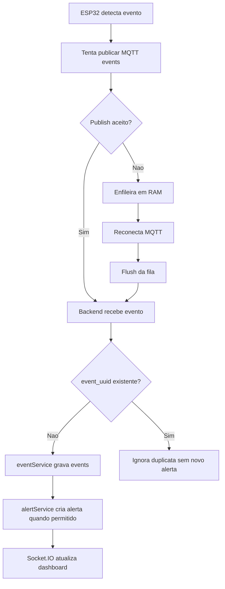

# Integração Firmware, Backend e Frontend

Este documento descreve o contrato MQTT real do projeto, o fluxo de pairing por código temporário e como os dados percorrem firmware, backend, banco e frontend no modelo multi-tenant atual.

Para hardware, pinagem e calibração do detector, consulte [firmware-hardware.md](firmware-hardware.md). Para o fluxo detalhado de queda/SOS e alertas internos, consulte [alerting-architecture.md](alerting-architecture.md). Para setup geral do projeto, consulte o [README da raiz](../README.md). Para o passo a passo operacional no Windows, consulte [quickstart-windows.md](quickstart-windows.md).

## O que mudou na integração

O sistema preservou o contrato MQTT, mas mudou o modelo de ownership do device.

Hoje existem duas camadas:

- descoberta técnica do hardware
- claim definitivo dentro de uma organização

Em outras palavras:

- um device desconhecido que chega por MQTT pode ser criado tecnicamente
- ele entra como `unclaimed`
- somente o fluxo de pairing por código temporário o transforma em device de fato pertencente a uma organização

### Sessão web JWT e canal MQTT

A integração frontend-backend usa JWT e escopo multi-tenant. Após o login, o frontend envia `Authorization: Bearer <token>` e `X-Organization-Id`; o backend valida o token, a membership, o papel e os pacientes permitidos antes de atender a API ou autorizar rooms do Socket.IO.

O MQTT do ESP32 é separado dessa sessão web: o device não reutiliza o JWT do navegador. A bridge MQTT resolve `device_uid`/`device_id`, claim, organização, paciente e assignment no backend antes de persistir ou emitir realtime. Essa separação evita misturar autenticação humana com identidade técnica do hardware.

## Identidade do dispositivo

O projeto agora trabalha com duas identidades complementares:

- `device_id`: identificador operacional usado nos tópicos MQTT, configurável no portal do ESP32
- `device_uid`: identidade técnica estável do hardware, derivada do ESP32

Regra atual:

- o backend prefere `payload.device_uid` quando ele existe
- se ele não vier, faz fallback para `legacy:{device_id}`

Isso preserva compatibilidade com devices antigos e permite evoluir para um claim mais seguro.

## Topicos MQTT reais

Base configurada no backend:

- `MQTT_TOPIC_BASE=queda/devices`

Topicos assinados:

- `queda/devices/+/events`
- `queda/devices/+/status`
- `queda/devices/+/telemetry`

Topicos publicados hoje pelo firmware:

- `queda/devices/{deviceId}/events`
- `queda/devices/{deviceId}/status`
- `queda/devices/{deviceId}/telemetry`

Observações importantes:

- o contrato MQTT foi preservado
- os tópicos continuam sendo montados a partir de `device_id`
- o backend continua conseguindo trabalhar com o mock publisher e com devices antigos
- backend e firmware foram preparados para `MQTT/TLS` de forma opt-in, sem mudar o fluxo padrão atual com `mqtt://`
- em debug de conectividade, o firmware imprime tópicos efetivos, host/porta MQTT e clientId sem expor senha

## Payloads reais do firmware

Os payloads continuam em `JSON` com `snake_case`, mas agora incluem `device_uid`.

### `events`

Exemplo de `fall_detected`:

```json
{
  "device_uid": "esp32-a1b2c3d4e5f6",
  "device_id": "esp32_01",
  "event_type": "fall_detected",
  "event_uuid": "esp32-a1b2c3d4e5f6-fall_detected-1760000000-12345-7",
  "event_sequence": 7,
  "sample_seq": 341,
  "timestamp": 1760000000,
  "accel_magnitude": 3.74,
  "gyro_magnitude": 182.5,
  "immobility_confirmed": true,
  "decision_source": "firmware",
  "algorithm_version": "threshold_fsm_v2_time_features_v1",
  "reason": "impact_orientation_immobility",
  "activity_state_estimate": "queda_confirmada",
  "confidence": 0.76,
  "features_time_domain": {
    "available": true,
    "sample_count": 64,
    "window_duration_ms": 3200
  },
  "features_frequency_domain": {
    "available": false,
    "experimental": true,
    "reason": "fft_experimental_disabled"
  },
  "battery_level": 78,
  "battery_percent": 78,
  "battery_percent_source": "manual"
}
```

O campo `timestamp` deve ser Unix time em segundos quando o NTP já sincronizou. Para `device_status.last_seen_at`, o backend usa a hora real de recebimento MQTT, porque a chegada de `status`/`telemetry` já prova presença recente do ESP32. Para `telemetry.created_at` e `events.event_time`, o timestamp do device só é usado quando é plausível e está próximo do recebimento; se o firmware estiver no fallback monotônico de boot (`millis()/1000`) ou com clock/NTP stale, o backend usa a hora de recebimento para evitar gráfico antigo, evidência quebrada e falso offline.

Para `fall_detected`, o firmware continua sendo a fonte da decisão local confirmada e do buzzer. O backend não recalcula a queda para acionar alarme local; ele audita o evento, preserva `raw_payload_json`, copia a decisão/feature set para `evidence_summary_json` e procura telemetria do mesmo device entre `event_time - 10s` e `event_time + 3s`. Se encontrar amostras, grava `evidenceStatus` (`partial` ou `linked`), `evidenceTelemetryId`, contagem, janela e resumo técnico. Se não encontrar, grava o evento com `evidenceStatus=none`, loga warning e não cria alerta automático de queda confirmada.

Na `v0.8.27`, o firmware também passou a publicar `fall_suspected` e `movement_detected` a partir de uma pré-calibração experimental salva no portal do ESP32. Na `v0.8.31`, `movement_detected` permanece persistido como evento informativo de baixa severidade, mas não cria alerta ativo nem buzzer. `fall_suspected` continua podendo criar alerta experimental para investigação, sem acionar o buzzer local. O alarme sonoro fica reservado para `fall_detected` confirmado e SOS.

Na `v0.8.28`, o contrato MQTT permanece o mesmo, mas a fronteira física da IMU ficou mais rígida: o firmware aceita `WHO_AM_I=0x68` (`MPU6050`), `0x70` (`MPU6500`) e `0x71` (`MPU9250`), usa a faixa efetiva lida em `ACCEL_CONFIG`/`GYRO_CONFIG`, preserva a última escala efetiva durante recoveries com readback falho, descarta amostra raw totalmente zerada e mantém `sensor_read_ok=false` quando a leitura falha. O buzzer continua sendo decisão local do firmware; alertas criados apenas no backend não acionam hardware sem um futuro comando MQTT de retorno para `queda/devices/{deviceId}/commands`.

Na `v0.8.29`, o contrato MQTT continua inalterado. A mudança foi apenas interna: campos comuns de `status`, `telemetry` e `events` passaram a ser montados por helpers compartilhados no firmware para reduzir divergência entre payloads. Os nomes de campos, tópicos, canais Socket.IO e regras de persistência permanecem os mesmos.

Na `v0.8.30`, a bateria deixa de ser placeholder. Quando o portal ESP32 tem uma porcentagem manual configurada, o firmware publica `battery_level`, `battery_percent` e `battery_percent_source="manual"` em `status`, `telemetry` e `events`. Quando não há valor configurado, publica `battery_percent_source="not_configured"` e omite os campos numéricos; o backend limpa bateria stale e o frontend mostra `--%`/`não informado`.

### Confiabilidade por criticidade

`telemetry` é periódica e pode tolerar perda eventual. Eventos críticos do canal `events`, como `fall_detected`, SOS manual e `sensor_fault`, precisam ser rastreáveis. Por isso, a `v0.8.25` adiciona:

- `event_uuid`: identifica o evento crítico de forma estável durante reenvios
- `event_sequence`: contador monotônico local de eventos críticos no firmware
- `sample_seq`: contador da amostra de sensor mais recente associada ao evento
- fila circular em RAM no firmware para reenviar eventos quando o MQTT voltar
- deduplicação no backend por `event_uuid`, sem exigir migration de schema



### Assets visuais

Capturas reais da integração web/MQTT ficam em [assets](assets/README.md). A `v0.9.0` possui evidências visuais do device online, tópicos MQTT observados, gráfico com `120` amostras, Modo Demo, portal ESP32 operacional, bateria estimada e queda confirmada. Também existe um tour visual lento da interface capturado com o sensor em repouso. O GIF de uma nova queda percorrendo ESP32/evento -> MQTT -> backend -> dashboard permanece pendente até existir uma gravação real em velocidade legível.

Imagens principais:

- [device online e diagnóstico MQTT](assets/screenshots/device-detail-online-v0.9.0.png)
- [telemetria real com 120 amostras](assets/screenshots/device-detail-telemetry-v0.9.0.png)
- [portal ESP32 operacional](assets/screenshots/esp32-maintenance-overview-v0.9.0.png)
- [queda confirmada real](assets/screenshots/alerts-fall-confirmed-v0.9.0.png)
- [bateria estimada real](assets/screenshots/battery-estimation-v0.9.0.png)
- [tour real da interface com sensor em repouso](assets/gifs/ui-tour-v0.9.0.gif)

### `status`

```json
{
  "device_uid": "esp32-a1b2c3d4e5f6",
  "device_id": "esp32_01",
  "event_type": "device_status",
  "timestamp": 1760000000,
  "accel_magnitude": 1.01,
  "gyro_magnitude": 8.4,
  "immobility_confirmed": false,
  "battery_level": 78,
  "battery_percent": 78,
  "battery_percent_source": "manual",
  "wifi_rssi": -58,
  "buffered_events": 0
}
```

### `telemetry`

```json
{
  "device_uid": "esp32-a1b2c3d4e5f6",
  "device_id": "esp32_01",
  "timestamp": 1760000000,
  "ax": 0.04,
  "ay": -0.02,
  "az": 0.98,
  "gx": 5.2,
  "gy": -1.1,
  "gz": 3.6,
  "accel_magnitude": 0.98,
  "gyro_magnitude": 6.4,
  "pitch_deg": -3.1,
  "roll_deg": 2.7,
  "battery_level": 78,
  "battery_percent": 78,
  "battery_percent_source": "manual",
  "wifi_rssi": -58
}
```

Unidades do contrato:

- `ax`, `ay`, `az`: aceleração em `g`
- `gx`, `gy`, `gz`: giro em `deg/s`
- `accel_magnitude`: aceleração resultante em `g`
- `gyro_magnitude`: giro resultante em `deg/s`

O firmware converte raw da IMU usando a faixa efetiva lida em `ACCEL_CONFIG`/`GYRO_CONFIG`. Em repouso, `accel_magnitude` deve ficar perto de `1.00 g`; valores estáveis perto de `4 g` indicam divisor de escala incorreto ou sensor ainda publicando firmware antigo. Os logs `raw_magnitude_g`, `corrected_magnitude_g` e `filtered_magnitude_g` ajudam a separar erro de escala, offset e filtro.

Falhas de readback ou calibração não devem interromper o contrato MQTT: o firmware usa fallback de escala, segue sem offsets quando necessário e publica telemetria se a leitura raw I2C estiver funcionando. Pacotes raw totalmente zerados são tratados como falha e não devem criar telemetria real.

Falhas transitórias de I2C também não devem derrubar Wi-Fi/MQTT. O firmware publica diagnósticos extras em `status` e, quando houver amostra real, também em `telemetry` (`sensor_ready`, `sensor_valid`, `sensor_read_ok`, `sensor_sample_age_ms`, `sensor_failures`, `i2c_error_count`, `i2c_recovery_count`, `i2c_last_error`). Quando a última amostra fica velha demais, o firmware mantém `status` com diagnóstico e pula `telemetry`; o backend também rejeita payloads de `telemetry` sem eixos reais para não criar `telemetry_logs` inválidos.

Para bateria, `battery_percent_source` informa a origem:

- `manual`: valor informado pelo operador no portal ESP32, apenas informativo
- `not_configured`: nenhum valor confiável disponível; backend/frontend devem mostrar bateria como não informada
- `automatic`, `adc` ou `fuel_gauge`: reservados para leitura automática futura

Payloads antigos com apenas `battery_level` ou `battery_percent` continuam aceitos. A `v0.8.30` apenas impede que o firmware real publique `100%` fixo quando não existe medição.

### Visualizacao da telemetria no frontend

O contrato MQTT e a persistência não mudam. Na página de detalhe do device, o gráfico principal usa a série `accel_magnitude` como `Aceleração resultante (g)`, com fallback visual calculado a partir de AX/AY/AZ quando a magnitude vier ausente ou fora da escala. O eixo Y e formatado em 2 casas decimais e o tooltip técnico mostra também `gyro_magnitude` em `deg/s` e AX/AY/AZ em `g`.

Para manter a demonstração legível, o frontend filtra apenas na visualização amostras inválidas (`null`, `NaN`, `Infinity`) e valores fora de escala operacional visual: `0-20 g` para aceleração e `0-2000 deg/s` para giroscópio no tooltip. Os dados brutos continuam chegando por MQTT e permanecem no banco.

## Status interpretado experimental

O backend agora deriva um status comportamental/postural inicial a partir da telemetria mais recente do device, sem alterar o contrato MQTT original.

Principios atuais:

- feature experimental e pre-calibração
- sem diagnóstico clínico
- prioridade para estados mais honestos quando a confiança estiver baixa
- preparada para evoluir no futuro sem quebrar o payload base

Estados implementados nesta versão:

- pré-calibração
- `desconhecido`
- `sem_telemetria_suficiente`
- sensor sem leitura válida
- `telemetria_desatualizada`
- `em_reposo`
- `repouso_provavel`
- `deitado`
- `sentado`
- `sentado_deitado_provavel`
- `em_movimento`
- `movimento_leve`
- `movimento_intenso`
- `queda_suspeita`
- `queda_confirmada`
- `sos_manual`
- calibração pendente
- em calibração

Estados reservados para evolução futura:

- `andando`
- `correndo`
- `caido`
- `queda_com_imobilidade`

Cada snapshot de device agora pode carregar um bloco derivado como:

```json
{
  "behavior": {
    "state": "repouso_provavel",
    "confidence": "medio",
    "reason": "Telemetria recente sugere repouso estável, ainda sem postura especifica forte.",
    "experimental": true,
    "version": "heuristic_v1",
    "source": "telemetry_window",
    "updatedAt": "2026-04-21T20:10:00.000Z",
    "telemetrySampleCount": 6,
    "telemetryWindowSeconds": 25,
    "plannedFutureStates": ["andando", "correndo", "caido"]
  }
}
```

Heuristica atual, em alto nível:

- sem telemetria suficiente: `sem_telemetria_suficiente`
- status online com sensor inválido: sensor sem leitura válida
- telemetria stale: `telemetria_desatualizada`
- janela inicial curta: calibração pendente
- baixa movimentacao: `repouso_provavel`
- baixa movimentacao + orientação horizontal/inclinada estável: `sentado_deitado_provavel`
- variação acima do repouso: `movimento_leve` ou `movimento_intenso`
- `fall_detected` recente: `queda_suspeita` ou `queda_confirmada`
- `fall_suspected` recente: `queda_suspeita`
- `movement_detected` recente: `movimento_intenso`
- `fall_detected` recente sem evidência de telemetria: no máximo `queda_suspeita`
- `sos_pressed` recente: `sos_manual`

O frontend usa esse bloco para mostrar o estado atual no dashboard, na lista de devices e na página de detalhe, sempre como heurística experimental.

## Realtime do painel x MQTT do device

Nesta baseline, o frontend passou a separar melhor tres camadas diferentes:

- socket do navegador com o backend (`Socket.IO`)
- último snapshot conhecido do device no backend
- presença recente de status/telemetria MQTT do ESP32

Regras práticas:

- `socket do painel desconectado` significa apenas que o navegador perdeu o canal realtime
- `device offline` continua significando ausência recente de `status`/`telemetry` MQTT no backend
- o frontend agora recebe `telemetry:new` com `deviceBehavior` e `deviceStatusPatch`, o que permite atualizar `lastSeenAt`, bateria, RSSI e a heurística local sem refetch completo a cada amostra
- a página de detalhe do device também faz um refresh HTTP leve a cada 10s como fallback, para cobrir perda de evento realtime durante reload, troca de sessão ou reconexao do socket

## Identidade do device MQTT

O firmware pode publicar `device_id` como identificador humano/técnico curto, por exemplo `esp32_01`, e `device_uid` como identidade física real do chip. Em bases antigas ou seeds de demo, alguns devices podem existir como `device_uid = legacy:{device_id}`.

Na ingestão MQTT atual, quando chega uma mensagem com `device_uid` real e o backend encontra um cadastro legado `legacy:{device_id}` já `claimed` e com organização, ele reconcilia o cadastro para o UID real antes de persistir status/telemetria. Se uma tentativa anterior já tiver criado um duplicado técnico sem organização para esse UID real, o backend move telemetrias, eventos e alertas desse duplicado para o device pareado e remove o duplicado.

Isso evita o caso em que o broker recebe telemetria corretamente, mas o dashboard da organização continua stale porque o payload foi associado a um device sem tenant. Se a mensagem MQTT chegar sem `device_uid` depois da reconciliação, o backend tenta associar por `device_id` apenas quando houver exatamente um cadastro pareado com aquele identificador.

Isso reduz a chance de interpretar uma falha do navegador como se o ESP32 tivesse realmente caído.

### Concorrência no realtime/MQTT

Nesta baseline, mensagens MQTT do mesmo `device_id` são serializadas por um lock leve em memória dentro da instância Node. O objetivo é impedir que dois pacotes simultâneos do mesmo ESP32 tentem reconciliar identidade, atualizar status e emitir realtime em ordem conflitante.

O lock é local ao processo. Ele cobre o ambiente atual de desenvolvimento e instância única; se o backend for escalado horizontalmente, a garantia precisa migrar para um lock distribuído, uma fila particionada por device ou outro mecanismo equivalente.

A entrega Socket.IO deixou de iterar todos os sockets conectados a cada evento. Cada conexão entra em rooms de organização, paciente ou plataforma global conforme o contexto de acesso, e `emitScopedEvent` publica diretamente nessas rooms.

## Pairing por código temporário

O pairing não acontece via MQTT. Ele acontece por HTTP entre o portal do ESP32 e o backend.

### Fluxo atual

1. o `organization_admin` abre a tela de devices
2. o frontend chama `POST /api/devices/pairing-sessions`
3. o frontend consulta `GET /api/system/network-info` para sugerir a melhor URL local do backend na rede atual
4. o modal destaca uma `primaryBackendApiBaseUrl`, mostra expiração do código e deixa as demais URLs em fallback opcional
5. o usuário abre o portal local do ESP32
6. informa `BACKEND_API_BASE_URL` e o código manualmente no portal local
7. o ESP32 chama `POST /api/pairing/claim`
8. o backend valida o código, classifica erros de inválido/expirado/já usado e faz o claim transacional
9. o backend devolve `deviceSyncToken` e um `patientProfile` resumido
10. o device passa para `claimed` e fica locked na organização
11. se o pairing session tiver um `patient_id`, o backend cria também o assignment inicial

No portal local do ESP32, a rodada atual também adicionou um bloco de saúde operacional com:

- `Wi-Fi conectado`
- `MQTT OK`
- `Backend API`
- `Pronto para operar`

Com `SETUP_PORTAL_ALWAYS_ON = true`, o portal também pode ficar em modo de manutenção paralelo: o AP `Q-ESP32-*` permanece visível, mas Wi-Fi station, MQTT, sensor, status/eventos e telemetria continuam no loop normal. Em `SETUP_MODE`, o portal continua sendo fallback/configuração e o operador pode usar `Testar backend` e `Testar MQTT` para validar a configuração antes de reiniciar o ESP32.

### Broker MQTT local no Windows

O broker local de desenvolvimento fica em `backend/scripts/devBroker.js` e usa `Aedes`. Para bancada com ESP32 físico, ele deve aceitar conexão pelo IPv4 da LAN do notebook:

```env
MQTT_BIND_HOST=0.0.0.0
MQTT_PORT=1883
```

Para descobrir quem está usando a porta:

```powershell
netstat -ano | findstr :1883
Get-CimInstance Win32_Process -Filter "ProcessId = PID_AQUI" | Select-Object ProcessId,CommandLine
```

Para validar o acesso esperado pelo ESP32:

```powershell
Test-NetConnection IP_DO_NOTEBOOK -Port 1883
```

O esperado é `TcpTestSucceeded : True`.

Esse teste valida apenas abertura de porta TCP. Para confirmar o protocolo MQTT, rode um cliente e aguarde `CONNACK`:

```powershell
cd backend
npm run mqtt:test -- 127.0.0.1 1883
npm run mqtt:test -- IP_DO_NOTEBOOK 1883
```

O esperado é `MQTT handshake OK`. Para o backend local, prefira `MQTT_BROKER_URL=mqtt://127.0.0.1:1883`; para o ESP32, use o IPv4 real do notebook.

`localhost`, `127.0.0.1` e `::1` apontam para o próprio computador e não servem como `MQTT_HOST` no ESP32. Mesmo com o broker em `0.0.0.0:1883`, firewall local ou isolamento de clientes em rede institucional ainda podem impedir a conexão.

### Diagnóstico de mensagens MQTT reais

Para ver se o ESP32 está publicando de fato no broker usado pelo backend:

```powershell
npm run mqtt:watch --prefix backend
```

O watcher assina os tópicos reais `queda/devices/+/status`, `queda/devices/+/telemetry` e `queda/devices/+/events`, e imprime uma linha JSON por mensagem com timestamp local, tópico, tamanho, resumo do payload e status de parse JSON.

Para testar backend, banco, Socket.IO e dashboard sem ESP32 físico:

```powershell
npm run mqtt:publish:test --prefix backend
npm run mqtt:publish:test --prefix backend -- --device esp32_01 --count 10 --interval-ms 1000
```

Esse publisher usa o mesmo contrato MQTT esperado pelo backend e publica `status` + telemetria em `queda/devices/{deviceId}/status` e `queda/devices/{deviceId}/telemetry`.

Para diferenciar fonte real e simulada:

- telemetria simulada usa `mqtt:publish:test` e aparece com `device_uid=legacy:esp32_01` por padrão
- telemetria real do firmware deve aparecer no broker com o `clientId` configurado no portal, como `esp32_01_client`
- no Serial Monitor do ESP32, o firmware registra `[telemetry] publish ok topic=queda/devices/esp32_01/telemetry bytes=...`
- se o Serial Monitor mostra `publish ok`, mas o watcher não recebe, investigue broker/host/rede
- se o watcher recebe e o dashboard não atualiza, volte para backend, escopo, assignment, Socket.IO ou frontend

O portal de manutenção em paralelo continua ativo sem ser `SETUP_MODE`. Para proteger o loop normal, ele não inicia scan Wi-Fi automático durante manutenção operacional; Wi-Fi station, MQTT, sensor, status, eventos e telemetria continuam sendo processados no loop principal.

### Endpoint usado pelo ESP32

- `POST /api/pairing/claim`
- `POST /api/pairing/device-profile-sync`

Payload esperado:

```json
{
  "device_uid": "esp32-a1b2c3d4e5f6",
  "device_id": "esp32_01",
  "device_name": "esp32_01",
  "pairing_code": "ABC123"
}
```

Resposta relevante do claim:

```json
{
  "deviceSyncToken": "token-hex-gerado-no-claim",
  "patientProfile": {
    "patientName": "Paciente Demo",
    "weightKg": 72.5,
    "heightCm": 168,
    "fallSensitivityPreset": null,
    "syncedAt": "2026-04-10T00:00:00.000Z"
  }
}
```

O `deviceSyncToken` não substitui o pairing code. Ele serve para sincronizações futuras do perfil resumido do paciente, sem deixar o backend depender apenas de `device_uid`.

### Endpoint de rede local para o dashboard

- `GET /api/system/network-info`

Resposta esperada:

```json
{
  "suggestedBackendApiBaseUrl": "http://192.168.0.15:4000",
  "primaryBackendApiBaseUrl": "http://192.168.0.15:4000",
  "fallbackBackendApiBaseUrls": [
    "http://10.0.0.8:4000"
  ],
  "candidateBackendApiBaseUrls": [
    "http://192.168.0.15:4000",
    "http://10.0.0.8:4000"
  ]
}
```

Esse endpoint ignora loopback, prioriza interfaces reais da rede atual e ajuda o frontend a destacar uma URL principal confiável para o ESP32, mantendo fallbacks apenas quando fizer sentido.

### Sincronizacao resumida do paciente para o ESP32

Depois do claim, e também em sincronizações posteriores, o ESP32 pode chamar:

- `POST /api/pairing/device-profile-sync`

Payload:

```json
{
  "device_uid": "esp32-a1b2c3d4e5f6",
  "device_id": "esp32_01",
  "device_sync_token": "token-hex-gerado-no-claim"
}
```

Resposta:

```json
{
  "patientProfile": {
    "patientName": "Paciente Demo",
    "weightKg": 72.5,
    "heightCm": 168,
    "fallSensitivityPreset": null,
    "syncedAt": "2026-04-10T00:00:00.000Z"
  }
}
```

O backend continua sendo a fonte da verdade. O ESP32 recebe apenas uma copia resumida e local.

## Auto-provisionamento técnico

O auto-provisionamento continua existindo, mas agora com comportamento mais seguro.

Se o backend receber um `device_uid` novo via MQTT:

1. ele cria um registro técnico em `devices`
2. o registro entra como `unclaimed`
3. o device ainda não pertence definitivamente a nenhuma organização
4. o claim oficial precisa acontecer depois pelo fluxo de pairing

Isso evita que qualquer device novo vire automaticamente dono de dados sensiveis de uma familia ou clínica.

## Persistencia do escopo no momento da ingestão

Ao ingerir novos dados, o backend passa a gravar o escopo vigente do device:

- `organization_id`
- `patient_id`
- `device_assignment_history_id`

Isso acontece em:

- `device_status`
- `telemetry_logs`
- `events`
- `alerts`

Consequência prática:

- se um device mudar de paciente no futuro, o histórico antigo continua atribuido ao paciente e assignment corretos da epoca

## Como o backend filtra acesso

O backend não depende de esconder dados no frontend.

Rotas protegidas usam:

- `Authorization: Bearer <token>`
- `X-Organization-Id: <id>`

Regras atuais:

- `platform_admin` pode operar globalmente ou escolher uma organização
- `organization_admin` enxerga toda a organização ativa
- `caregiver`, `operator` e `viewer` nunca enxergam outra organização
- quando existem caregiver assignments para o membro, o backend restringe também ao conjunto de pacientes atribuidos

Isso vale para:

- `devices`
- `events`
- `alerts`
- `telemetry`
- `dashboard`
- `device detail`
- `patients`
- `organization members`

## Boot da sessão no frontend

Na inicializacao da interface web:

1. o frontend lê token e organização ativa do `localStorage`
2. reidrata o usuário com `GET /api/me`
3. se a organização salva não for mais válida para o usuário, remove apenas esse ID local e tenta `/me` novamente
4. normaliza memberships e organização ativa antes de abrir as rotas protegidas
5. cria o Socket.IO somente depois que token, usuário e organização ativa estão minimamente hidratados
6. passa a enviar `X-Organization-Id` e `organizationId` do socket com base nesse contexto atualizado

Isso reduz quebra por F5/refresh e por sessão antiga salva no navegador depois de mudanças de contrato no backend.

## Dashboard e tempo real

O dashboard deixou de somar tudo globalmente.

Hoje ele soma apenas:

- a organização ativa do usuário
- e, quando houver caregiver assignments, o subconjunto permitido para aquele membro

O mesmo principio vale para `Socket.IO`:

- o socket recebe token e `organizationId`
- o backend emite `alert:new`, `alert:updated`, `device:status` e `telemetry:new` apenas para conexoes autorizadas naquele escopo

### Exportação do histórico de alertas

`GET /api/alerts/export` reutiliza a autenticação JWT, o header `X-Organization-Id`, os filtros e o escopo multi-tenant de `listAlerts`. A rota aceita `status`, `severity`, `deviceId`, `startDate` e `endDate`, fica declarada antes de `/alerts/:id` e retorna no máximo `500` registros.

O frontend usa o mesmo JSON para duas saídas:

- download estruturado `.json`
- página imprimível aberta pelo navegador, com `window.print()` para salvar em PDF

Nenhuma biblioteca pesada de geração de PDF foi adicionada. Ações humanas sobre alertas continuam registradas em `alert_actions` e, quando aplicável, em `audit_logs`.

Para banco existente sem a tabela de ações, aplique:

```powershell
npm run db:migrate:alert-actions --prefix backend
```

A migração é idempotente e não reseta dados. Administradores também podem usar `POST /api/devices/:id/assign-patient` com `patientId: null`, `POST /api/devices/:id/reset-claim` e `POST /api/patients/:id/archive`. As três rotas preservam histórico e registram auditoria; o reset de claim não usa `DELETE /api/devices/:id`.

No resumo atual do dashboard:

- `recentEvents` volta a incluir `patient`, `device`, `assignmentHistoryId`, `intensity` e `immobility`
- isso permite ao frontend exibir o contexto clínico correto sem refazer lookup adicional para cada card

## Conflitos e concorrência

### Alertas

As operações `acknowledge`, `cancel` e `resolve` agora protegem concorrência no backend. Quando dois operadores tentam mudar o mesmo alerta ao mesmo tempo, apenas uma transição válida persiste e a outra recebe conflito coerente.

### Claim de device

O claim por código também e transacional e protege:

- código expirado
- código já usado
- device já claimed por outra organização

## Diferenca entre firmware real e mock publisher

O mock continua útil para demo, mas não e identico ao firmware real.

Hoje:

- ele publica `device_uid = legacy:{deviceId}`
- pode enviar alguns campos extras como `message` e `firmware_version`
- continua preservando o contrato base de `events`, `status` e `telemetry`

Essas diferenças não quebram a integração atual, mas precisam ser lembradas em demonstrações.

## Automação local e smoke test

O smoke test do Windows também foi alinhado ao modelo multi-tenant atual.

Fluxo:

1. faz login
2. lê `activeOrganizationId` devolvido pelo backend
3. envia `X-Organization-Id` nas chamadas protegidas
4. valida `organization`, `patients`, `dashboard`, `devices` e `alerts`

Isso ajuda a pegar regressão real de escopo, em vez de apenas confirmar que o backend subiu.

## Testes de alertas, MQTT e stress

A rodada atual mantém testes `node:test` focados no backend e separa claramente smoke, integração leve, stress dry-run e stress real:

```powershell
npm test --prefix backend
npm run test:smoke --prefix backend
npm run test:integration --prefix backend
npm run test:alerts --prefix backend
npm run test:mqtt --prefix backend
npm run stress:dry --prefix backend
npm run stress:real --prefix backend
```

Os testes cobrem:

- severidade e decisão de criar alerta em `eventService`
- criação idempotente e transições de `alertService`
- descartes e persistência simulada em `mqttIngestionService`
- lock por `device_id` em mensagens simultâneas
- emissão Socket.IO escopada para organização/paciente/plataforma
- vinculo entre `fall_detected` e telemetria recente
- bloqueio de alerta automático de queda sem evidência
- gráfico frontend com eixo temporal numérico para reduzir aparência de telemetria travada

`stress:dry` substitui o antigo nome ambíguo de stress local mockado. Ele pressiona o fluxo em processo local, mas não mede broker, backend e MySQL reais.

`stress:real` valida backend `/health`, broker MQTT e banco MySQL de desenvolvimento antes de publicar mensagens MQTT reais e consultar persistência depois do teste. Ele aborta em produção e falha claramente quando algum pré-requisito não estiver disponível.

Para uso acadêmico e preparação de demonstração:

- [roteiro-demonstracao.md](roteiro-demonstracao.md) organiza uma apresentação curta do fluxo ponta a ponta
- [checklist-validacao.md](checklist-validacao.md) separa validação automatizada, smoke local, integração real e testes manuais com hardware

As suites geram:

```text
backend/logs/stress/stress-<runId>.jsonl
backend/logs/stress/summary-<runId>.json
backend/logs/stress/failures-<runId>.json
backend/logs/stress/report-<runId>.md
```

Elas não disparam notificação externa. No estado atual do projeto, alerta significa registro interno em banco e realtime no painel; SMS, WhatsApp, e-mail, push e webhook ficam como camada futura documentada em [alerting-architecture.md](alerting-architecture.md).

## Observações operacionais importantes

- `telemetry` continua fora do `EventBuffer` do firmware
- bateria do firmware real só é publicada quando existe valor manual no portal ou leitura automática futura; sem isso, `battery_percent_source=not_configured`
- o firmware só considera o device realmente saudável quando `Wi-Fi + MQTT` estão simultaneamente ok
- eventos críticos pendentes ficam primeiro em RAM; um snapshot pequeno em `NVS` pode reduzir perda após reboot rápido, mas não substitui persistência durável
- o AP curto `Q-ESP32-*` pode ficar sempre ativo em bancada com `SETUP_PORTAL_ALWAYS_ON = true`; com a flag desligada, aparece apenas em `SETUP_MODE` ou quando `FORCE_SETUP_MODE_ON_BOOT = true`
- para depuração local no Windows, a porta serial também pode ser liberada com `.\scripts\free-serial-port.ps1 -Port COM5` quando um monitor `PlatformIO` antigo ficar preso; substitua pela `COM` real se usar outra placa
- o ESP32 novo com CP210x em `COM5` fez upload sem segurar `BOOT`; se outra placa exigir `BOOT`, trate como limitação daquele hardware/driver específico
- o pairing depende de o backend estar acessível ao ESP32 pela rede atual
- `localhost` nunca deve ser usado dentro do portal do ESP32 para broker MQTT ou backend API

## Limitações abertas

- o fluxo padrão do projeto continua usando `mqtt://` sem TLS, embora a base para `mqtts://` já exista de forma opt-in
- não existe ainda fluxo completo de unpair entre organizações pela UI
- o portal do ESP32 salva `BACKEND_API_BASE_URL`, mas não faz autenticação local própria
- se um caregiver não tiver assignments explícitos, o backend hoje ainda devolve a organização ativa inteira para ele

## Integração v0.9.0

`status` e `telemetry` passam a carregar `detector_mode`, `sample_interval_ms` e `telemetry_interval_ms`. Eventos de detecção incluem também `impact_detected`, `orientation_change_detected`, `immobility_detected`, thresholds efetivos e motivo final. O backend preserva esses campos em `raw_payload_json` e `evidence_summary_json`; o frontend apenas apresenta a decisão do firmware.

Para bateria, o firmware publica `battery_manual_percent`, `battery_manual_updated_at`, `battery_calibration_sequence` e a taxa inicial. O backend registra cada sequência uma única vez em `battery_calibrations`, calcula a estimativa e persiste o snapshot em `device_status`. Payload antigo sem sequência continua aceito no fluxo legado.

Payloads antigos de `status` ou `telemetry` sem qualquer campo de bateria também continuam aceitos. A ingestão e o `deviceService` normalizam `battery_calibration_count` ausente para `0`, evitando enviar `NULL` para a coluna `NOT NULL` e preservando os demais campos opcionais de bateria como nulos quando permitido.

Aplicação incremental em banco existente:

```powershell
npm run db:migrate:battery-estimation --prefix backend
```

A migração usa verificações de schema, `ALTER TABLE ... ADD COLUMN` somente quando necessário e `CREATE TABLE IF NOT EXISTS`; não executa `DROP`, `TRUNCATE`, `DELETE` ou `db:init`.
